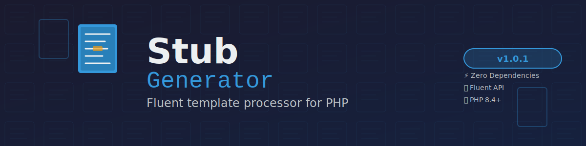

<div align="center">



# Stub Generator

**A powerful, fluent stub template processor for PHP with support for placeholders and optional sections**

[](https://www.php.net/)
[](https://packagist.org/packages/pixielity/stub-generator)
[](https://packagist.org/packages/pixielity/stub-generator)
[](LICENSE)
[](https://github.com/pixielity-co/stub-generator/actions)

[Features](#-features) •
[Installation](#-installation) •
[Quick Start](#-quick-start) •
[Documentation](#-documentation) •
[API Reference](#-api-reference)

</div>

---

## 🎯 What is Stub Generator?

Stub Generator is a lightweight, zero-dependency PHP library for processing template files (stubs) with placeholder replacement and optional sections. Inspired by Laravel Modules' Stub class, it provides a fluent, chainable API for generating files from templates.

### Why Stub Generator?

- **🚀 Zero Dependencies** - Pure PHP, no external dependencies required
- **⚡ Fluent API** - Chainable methods for elegant code
- **🎯 Simple & Powerful** - Easy to use, yet feature-rich
- **💎 Laravel-Style** - Familiar API for Laravel developers
- **🔧 Flexible** - Supports multiple placeholder formats
- **📦 Lightweight** - Minimal footprint, maximum performance

---

## ✨ Features

### Core Features
- **Fluent Interface** - Chainable methods for better developer experience
- **Placeholder Replacement** - Replace `$PLACEHOLDER$` or `{{PLACEHOLDER}}` with values
- **Optional Sections** - Remove optional sections based on conditions
- **File Operations** - Read templates and save processed content
- **Custom Base Path** - Support for custom stub directories
- **Magic Methods** - Use stub object directly as string

### Developer Experience
- **Automatic Uppercase** - Keys automatically converted to UPPERCASE
- **Backward Compatible** - Supports both `$KEY$` and `{{KEY}}` formats
- **Clear Exceptions** - Helpful error messages with context
- **Well Documented** - Comprehensive docblocks and examples
- **Type Safe** - Full PHP 8.4 type declarations

---

## 📦 Installation

### Requirements

- **PHP**: 8.4 or higher

### Via Composer

```bash
composer require pixielity/stub-generator
```

---

## ⚡ Quick Start

### 1. Basic Usage

```php
use Pixielity\StubGenerator\StubGenerator;

// Create and render a stub
$content = StubGenerator::create('template.stub', [
    'name' => 'John Doe',
    'email' => 'john@example.com',
])->render();

echo $content;
```

### 2. Save to File

```php
// Generate and save to file
StubGenerator::create('docker/redis.yml', [
    'container_prefix' => 'myapp',
    'redis_port' => '6379',
])->saveTo('/path/to/output', 'docker-compose.yml');
```

### 3. Remove Optional Sections

```php
// Remove optional sections
$content = StubGenerator::create('docker/elasticsearch.yml', [
    'elasticsearch_password' => 'secret',
])
->removeSection('kibana')  // Remove Kibana section
->render();
```

### 4. Chainable API

```php
// Chain multiple operations
$stub = StubGenerator::create('template.stub')
    ->replace(['key1' => 'value1'])
    ->replace(['key2' => 'value2'])
    ->removeSection('optional')
    ->render();
```

---

## 📚 Documentation

### Placeholder Format

Stub Generator supports two placeholder formats:

#### Primary Format (Recommended)
```
$PLACEHOLDER_NAME$
```

#### Legacy Format (Backward Compatibility)
```
{{PLACEHOLDER_NAME}}
```

### Example Template

```yaml
# template.yml
container_name: "$CONTAINER_PREFIX$-redis"
ports:
  - "$REDIS_PORT$:6379"
environment:
  REDIS_PASSWORD: "$REDIS_PASSWORD$"
```

### Usage

```php
$content = StubGenerator::create('template.yml', [
    'container_prefix' => 'myapp',  // Auto-converted to $CONTAINER_PREFIX$
    'redis_port' => '6379',         // Auto-converted to $REDIS_PORT$
    'redis_password' => 'secret',   // Auto-converted to $REDIS_PASSWORD$
])->render();
```

### Optional Sections

Mark optional sections in your templates:

```yaml
services:
  elasticsearch:
    image: elasticsearch:8.11.0
    
  # SECTION:kibana
  kibana:
    image: kibana:8.11.0
    depends_on:
      - elasticsearch
  # END_SECTION:kibana
```

Remove sections programmatically:

```php
// Include Kibana
$withKibana = StubGenerator::create('elasticsearch.yml', [...])->render();

// Exclude Kibana
$withoutKibana = StubGenerator::create('elasticsearch.yml', [...])
    ->removeSection('kibana')
    ->render();
```

---

## 🎮 API Reference

### Static Factory Method

```php
/**
 * Create a new stub generator instance.
 *
 * @param  string $path     Relative path to stub file
 * @param  array  $replaces Placeholder replacements
 * @return self
 */
public static function create(string $path, array $replaces = []): self
```

### Instance Methods

```php
/**
 * Set or merge placeholder replacements.
 *
 * @param  array $replaces Placeholder replacements
 * @return self
 */
public function replace(array $replaces): self

/**
 * Remove an optional section from the template.
 *
 * @param  string $name Section name
 * @return self
 */
public function removeSection(string $name): self

/**
 * Render the stub with all replacements applied.
 *
 * @return string Processed content
 */
public function render(): string

/**
 * Alias for render().
 *
 * @return string Processed content
 */
public function getContents(): string

/**
 * Render and save to file.
 *
 * @param  string $path     Directory path
 * @param  string $filename File name
 * @return bool Success status
 */
public function saveTo(string $path, string $filename): bool

/**
 * Set custom base path for stubs.
 *
 * @param  string $path Base path
 * @return void
 */
public static function setBasePath(string $path): void

/**
 * Get current base path.
 *
 * @return string|null Base path
 */
public static function getBasePath(): ?string

/**
 * Magic method to convert stub to string.
 *
 * @return string Processed content
 */
public function __toString(): string
```

---

## 🏗️ Advanced Usage

### Custom Base Path

```php
// Set custom stub directory
StubGenerator::setBasePath('/custom/stubs/path');

// Now all stubs are loaded from custom path
$content = StubGenerator::create('template.stub', [...])->render();

// Reset to default
StubGenerator::setBasePath(null);
```

### Multiple Sections

```php
// Remove multiple sections
$content = StubGenerator::create('template.stub', [...])
    ->removeSection('section1')
    ->removeSection('section2')
    ->removeSection('section3')
    ->render();
```

### Direct String Conversion

```php
// Use __toString() magic method
$stub = StubGenerator::create('template.stub', [...]);
echo $stub;  // Automatically calls render()
```

---

## 🧪 Testing

```bash
# Run tests
composer test

# Run tests with coverage
composer test:coverage

# Run all quality checks
composer check
```

---

## 🤝 Contributing

We welcome contributions! Please see [CONTRIBUTING.md](CONTRIBUTING.md) for details.

### Quick Contribution Guide

1. Fork the repository
2. Create a feature branch (`git checkout -b feature/amazing-feature`)
3. Make your changes
4. Run quality checks (`composer check`)
5. Commit your changes (`git commit -m 'feat: add amazing feature'`)
6. Push to the branch (`git push origin feature/amazing-feature`)
7. Open a Pull Request

---

## 📄 License

Stub Generator is open-sourced software licensed under the [MIT license](LICENSE).

---

## 🙏 Credits

Inspired by:
- [Laravel Modules](https://github.com/nWidart/laravel-modules) - Original Stub class design
- [Laravel](https://laravel.com/) - Fluent API patterns

---

## 📞 Support

- **Documentation**: [GitHub README](https://github.com/pixielity-co/stub-generator#readme)
- **Issues**: [GitHub Issues](https://github.com/pixielity-co/stub-generator/issues)
- **Packagist**: [pixielity/stub-generator](https://packagist.org/packages/pixielity/stub-generator)

---

<div align="center">

Made with ❤️ by the Pixielity team

</div>
